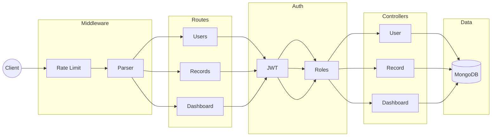

# Zorvyn — Finance Dashboard API

> A secure, role-based RESTful API for financial record management, built with Node.js, Express, MongoDB, and JWT authentication. Fully documented with Swagger UI.

---

## Test Credentials

Use these pre-seeded accounts to test role-based access:

| Role | Email | Password | Access Level |
|---|---|---|---|
| Viewer | viewer@test.com | 123456 | Read only — view records and dashboard |
| Analyst | analyst@test.com | 123456 | Read + dashboard insights |
| Admin | admin@test.com | 123456 | Full CRUD access |

---

## Table of Contents

- [Overview](#overview)
- [Tech Stack](#tech-stack)
- [Architecture](#architecture)
- [Project Structure](#project-structure)
- [API Endpoints](#api-endpoints)
- [Role-Based Access Control](#role-based-access-control)
- [Getting Started](#getting-started)
- [Environment Variables](#environment-variables)
- [How to Test with Swagger](#how-to-test-with-swagger)

---

## Overview

**Zorvyn** is a production-ready backend API designed for financial dashboards. It enables organizations to manage income and expense records with fine-grained access control, ensuring users only see and do what their role permits.

**Key Capabilities:**
- JWT-based authentication with secure password hashing (bcrypt)
- Three-tier Role-Based Access Control: `viewer`, `analyst`, `admin`
- Full CRUD on financial records with soft-delete
- Advanced filtering, search, and pagination on records
- Dashboard summary with income/expense totals, net balance, and category breakdown
- Rate limiting to protect against abuse (100 requests / 15 min per IP)
- Input validation on all sensitive endpoints
- Interactive Swagger UI API documentation

---

## Tech Stack

| Technology | Purpose |
|---|---|
| Node.js + Express.js v5 | Runtime and HTTP server |
| MongoDB + Mongoose | Database and ODM |
| JSON Web Tokens (JWT) | Stateless authentication |
| bcryptjs | Password hashing |
| express-validator | Input validation |
| express-rate-limit | Abuse prevention (100 req / 15 min) |
| swagger-jsdoc + swagger-ui-express | Interactive API documentation |
| nodemon | Development hot-reload |

---

## Architecture



## Project Structure

```
Zorvyn/
├── server.js                  # Entry point — Express setup, DB connection, route wiring
│
├── config/
│   └── swagger.js             # Swagger/OpenAPI 3.0 configuration
│
├── routes/
│   ├── userRoutes.js          # Auth routes: register, login, list users
│   ├── recordRoutes.js        # Financial record CRUD routes
│   └── dashboardRoutes.js     # Dashboard summary route
│
├── controllers/
│   ├── userController.js      # Register, login, get users logic
│   ├── recordController.js    # Create, read, update, soft-delete records
│   └── dashboardController.js # Aggregate income/expense/balance stats
│
├── middleware/
│   ├── authMiddleware.js      # JWT token verification (protect)
│   ├── roleMiddleware.js      # Role-based access gate (authorizeRoles)
│   ├── validateMiddleware.js  # express-validator error handler
│   ├── rateLimiter.js         # IP-based rate limiter
│   └── errorMiddleware.js     # Global error handler
│
├── models/
│   ├── userModel.js           # User schema: name, email, password, role, isActive
│   └── recordModel.js         # Record schema: amount, type, category, date, notes, isDeleted
│
├── .gitignore
└── package.json
```

---

## API Endpoints

### Users

| Method | Endpoint | Auth | Description |
|---|---|---|---|
| `POST` | `/api/users/register` | Public | Register a new user |
| `POST` | `/api/users/login` | Public | Login and receive JWT token |
| `GET` | `/api/users/` | Bearer Token | Get all users |

### Records

| Method | Endpoint | Auth | Role Required | Description |
|---|---|---|---|---|
| `POST` | `/api/records/` | Bearer Token | `admin` | Create a financial record |
| `GET` | `/api/records/` | Bearer Token | `viewer`, `analyst`, `admin` | List records with filters and pagination |
| `PUT` | `/api/records/:id` | Bearer Token | `admin` | Update a record |
| `DELETE` | `/api/records/:id` | Bearer Token | `admin` | Soft-delete a record |

**Query Parameters for `GET /api/records/`:**

| Param | Type | Example | Description |
|---|---|---|---|
| `page` | number | `1` | Page number |
| `limit` | number | `5` | Records per page |
| `search` | string | `salary` | Search by category or notes |
| `type` | string | `income` | Filter by `income` or `expense` |
| `category` | string | `food` | Filter by category name |
| `startDate` | date | `2024-01-01` | Date range filter start |
| `endDate` | date | `2024-12-31` | Date range filter end |

### Dashboard

| Method | Endpoint | Auth | Description |
|---|---|---|---|
| `GET` | `/api/dashboard/` | Bearer Token | Total income, expense, balance, category breakdown, and recent 5 records |

---

## Role-Based Access Control

Zorvyn enforces a three-tier permission model using JWT claims and route-level middleware:

| Feature | Viewer | Analyst | Admin |
|---|---|---|---|
| View Records | Yes | Yes | Yes |
| Dashboard | Yes | Yes | Yes |
| Create Record | No | No | Yes |
| Update Record | No | No | Yes |
| Delete Record | No | No | Yes |

Roles are assigned at registration and embedded in the JWT payload. Every protected route first verifies the token (`authMiddleware`), then checks the user's role (`roleMiddleware`).

---

## Getting Started

**Prerequisites:** Node.js v18+, MongoDB (local or Atlas)

```bash
# 1. Clone the repository
git clone https://github.com/VivekReddyVicky24/Zorvyn.git
cd Zorvyn

# 2. Install dependencies
npm install

# 3. Set up environment variables
cp .env.example .env
# Edit .env with your values

# 4. Start development server
npm run dev

# 5. Start production server
npm start
```

The server runs on `http://localhost:5000` by default.

---

## Environment Variables

Create a `.env` file in the project root:

```env
PORT=5000
MONGO_URI=mongodb://localhost:27017/zorvyn
JWT_SECRET=your_super_secret_jwt_key
```

| Variable | Description |
|---|---|
| `PORT` | Port to run the Express server (default: 5000) |
| `MONGO_URI` | MongoDB connection URI (local or Atlas) |
| `JWT_SECRET` | Secret key used to sign and verify JWTs |

---

## How to Test with Swagger

Swagger UI is available at: **`http://localhost:5000/api-docs`**

**Step 1 — Login via API:**
```http
POST /api/users/login
Content-Type: application/json

{
  "email": "admin@test.com",
  "password": "123456"
}
```

**Step 2 — Copy the token** from the response:
```json
{
  "token": "eyJhbGciOiJIUzI1NiIsInR5cCI6..."
}
```

**Step 3 — Authorize in Swagger UI:**
1. Click the **Authorize** button at the top right of Swagger UI
2. Paste your token in this format:
```
Bearer YOUR_TOKEN_HERE
```
3. Click **Authorize**, then **Close**

**Step 4 —** All subsequent requests will include your token automatically. Try switching between different role credentials to observe access differences.
